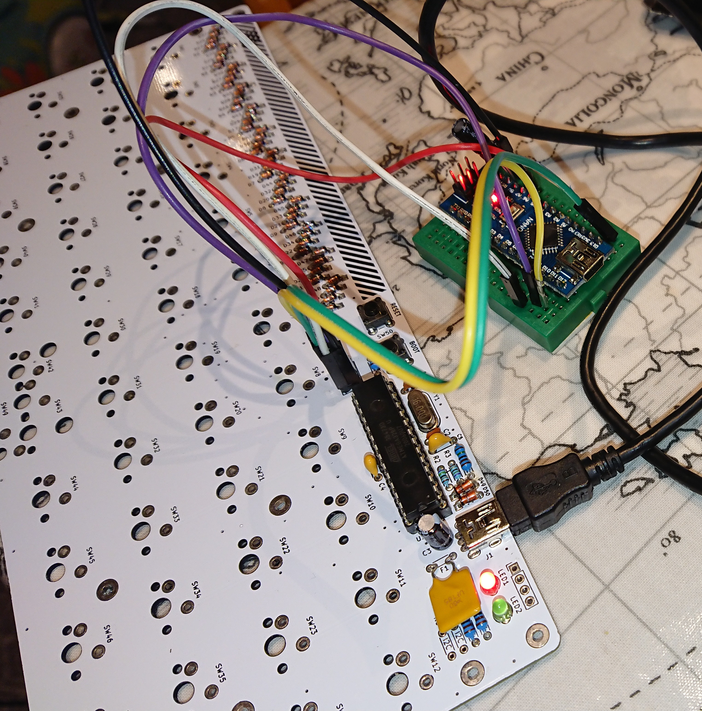
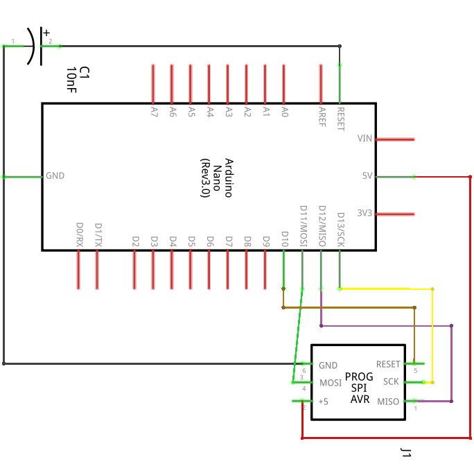
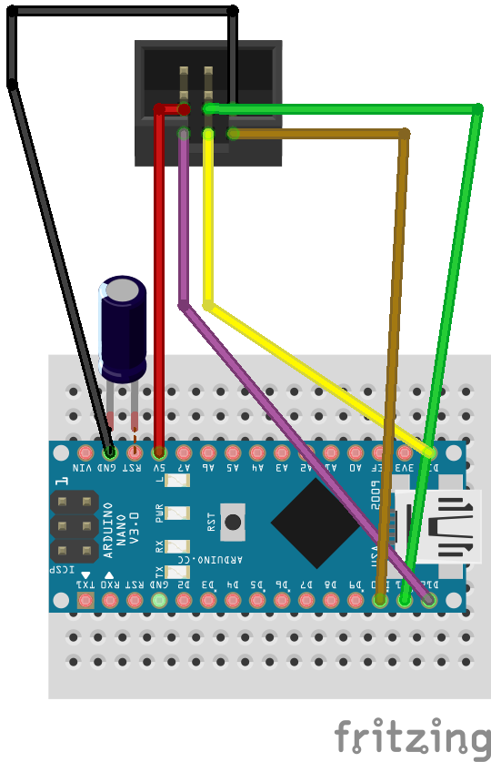

About six months ago I was bitten by the mechanical keyboard bug and made a numpad (a [yampad](https://github.com/mattdibi/yampad) to be precise). Too much time and money later, I have made a custom split keyboard (based on the [lily58](https://github.com/kata0510/Lily58)) and also tackled an ortholinear keyboard called the [plaid](https://github.com/hsgw/plaid), made using through-hole components.

I was finding it very difficult to burn the bootloader and upload the keyboard firmware to the plaid. It seemed like there was no good instructions to be found anywhere, and what information I did find relied on Teensy or dedicated serial programmers that I don't own. So I decided to write down a full list of instructions, based on the use of an Arduino, which far more people own.



These instructions were successfully used on the plaid keyboard but are also likely to be useful for [discipline](https://github.com/coseyfannitutti/discipline), [discipad](https://github.com/coseyfannitutti/discipad), [torn](https://github.com/rtitmuss/torn), [lumberjack](https://github.com/peej/lumberjack-keyboard) and other through-hole mechanical keyboards with the same atmega328p chip.

## You will need

* Arduino (I used a Nano but an Uno is typically used)
* USB cables (micro for keyboard, plus a compatible one for your Arduino if different)
* Male-female jumper wire and breadboard and 10nF electrolytic capacitor (if using a nano) OR
* Female-female jumper wire (if using an uno)
* USB cable
* Computer with the following software installed:
   + Arduino software
   + Avrdude installed
   + [QMK](https://qmk.fm/) installed

## Prepare the Arduino
Connect the Arduino to your computer using the USB port. Upload the inbuilt example sketch called ArduinoISP using the Arduino software to the Arduino board. My Nano was old and a cheap clone so I needed to set the board as "Arduino Nano" and processor "ATmega328P(Old Bootloader)". Once this sketch is uploaded the Arduino has become an AVRISP programmer with a baud rate of 19200 (different speeds can be set but this is the default in the sketch).

## Prepare the keyboard
First prepare the hardware, starting by disconnecting your Arduino from your computer. With a Nano, it is best to plant it on a breadboard and use Male-female jumper wire to make the connection. Another peculiarity of the Nano, you need to place a 10nF electrolytic capacitor between ground and reset (negative to ground). According to [this site](http://www.martyncurrey.com/arduino-nano-as-an-isp-programmer/), the capacitor is needed to keep the reset pin high. 

Connect wires between the 6 pins on the plaid keyboard labelled "ISP" to the arduino. From the pcb layout I worked out what the pinout should be for the 6 pins, outlined below.



### ISP pinout configuration

The arrow on the plaid silkscreen next to one of the ISP pins is designated pin 1. If pin 1 is at the top left we read the numbers left to right and up to down. With this in mind, connect each pin to the arduino pin named below:

1. D12
2. +5V pin
3. D13
4. D11
5. RESET (D10)
6. GND



## Make the bootloader file

There are a few ways to make and burn the bootloader. You only have to choose one method. At this point reconnect your Arduino to your computer using the USB cable.

### The straightforward command line way
By far the easiest way to do this is to download [this hex file](https://github.com/Daveyr/plaid/blob/add-bootloader-info/bootloader/plaid_default.hex) I made earlier. You can skip the rest of this section until _Burn the bootloader_ unless you are interested in where it came from. Thanks to Github user [itsnoeasy](https://github.com/hsgw/plaid/issues/10#issuecomment-583849113), this is how I made it.

In a terminal window in your qmk folder, type `make dm9records/plaid:default`. This compiles a hex file of the keyboard firmware. Edit this file in a text editor to remove the last line, which should read :00000001FF. Then append the contents of [this hex file](https://github.com/hsgw/USBaspLoader/blob/plaid/firmware/main.hex), which comes from the USBASPLoader repository. What we're doing is concatenating the plaid firmware with the bootloader so that not only do we have a working keyboard but also the ability to upload new firmware by usb in future. Rename the file to `plaid_default.hex`.

#### Burn the bootloader

In the same terminal window, enter the following.

```
avrdude -u -c avrisp -p m328p -P /dev/ttyUSB0 -b 19200 -U flash:w:"plaid_default.hex":a -U lfuse:w:0xF7:m -U hfuse:w:0xD0:m -U efuse:w:0xfc:m
```

What's going on here? We execute avrdude with a series of arguments, comprising the following in order

* `-u` disables safemode
* `-c avrisp` is the programmer. We are using an arduino as a programmer, but we made it into an avrisp using the sketch earlier
* `-p m328p` is the target chip on the keyboard, which is an ATmega328p
* `-P /dev/ttyUSB0` is the target port where the Nano is located. It is highly likely that this is the same for you, but could be different if, for instance, you have other USB devices connected. Check >menu>port in the Arduino software if unsure.
* `-b 19200` is the baud rate. If you changed this in the avrisp sketch then change it here too
* `-U flash:w:"plaid_default.hex":a` is the .hex file to upload, referred to earlier. If you are not in the folder where this is located then you will need to specify the filepath as well as the filename.
* `-U lfuse:w:0xF7:m -U hfuse:w:0xD0:m -U efuse:w:0xfc:m` are the fuse bits. We are setting the fuses at the same time as uploading the bootloader and the plaid firmware. lfuse, hfuse and efuse refer to low, high and extended fuse bits, respectively

Note, I believe the original author of USBASP made a mistake with the calculation of the extended fuse bit: the original specification called for the extended fuse bit set to 0x04 but this isn't an allowable value. In binary, a hex value of 4 corresponds with 00000100 in binary (i.e., bits 7 to 3: 000000, bit 2: 1 * 4, bit 1: 0 * 2, bit 0: 0 * 1). According to this [fuse calculator](https://www.engbedded.com/fusecalc/), the extended fuse bit is defined according to bit 0, 1 and 2. This corresponds with Brown-out Detector trigger level 0, 1 and 2, respectively. However, for all fuses there are 8 bits and a binary value of 1 actually means _not selected_. Efuse setting 0x04 was probably intended to mean BODLEVEL 2, but the truth is that all other bits _apart from this_ would be set, including bits 3 to 7 which don't apply to the efuse. To set BODLEVEL 2 we actually need the inverse: 11111011 (252, or 256 - 4). In hex, this is 0xfc (f is 15, c is 12, and 15 * 16^1 + 12 * 16^0 = 252) so we will use this fuse setting instead.

### The from-scratch method

I have modified the USBASPloader repository to be compatible with an Arduino being used as an avrisp programmer. I have also modified the extended fuse bit setting as per above. Clone [this repository](https://github.com/Daveyr/plaid_bootloader/tree/plaid_arduino) and in the root folder enter the following.

```
make
make flash
make fuse
```

This should compile the USBASP bootloader, flash it to the keyboard and set the fuse bits according to the makefile instructions. This method is not fully tested (I had already burnt the bootloader using the first method so could not be sure that this method overwrote it).

### The Arduino software method

Locate your boards.txt file for the Arduino software (mine was in ./hardware/arduino/avr) and add the following board definition. This will give the option of "Plaid Keyboard" in the list of boards available in the software.

```
##############################################################

plaid.name=Plaid Keyboard

plaid.vid.0=0x2341
plaid.pid.0=0x0043
plaid.vid.1=0x2341
plaid.pid.1=0x0001
plaid.vid.2=0x2A03
plaid.pid.2=0x0043
plaid.vid.3=0x2341
plaid.pid.3=0x0243

plaid.upload.tool=avrdude
plaid.upload.protocol=arduino
plaid.upload.maximum_size=32256
plaid.upload.maximum_data_size=2048
plaid.upload.speed=19200
plaid.upload.using=arduino:arduinoisp
plaid.bootloader.tool=avrdude
plaid.bootloader.low_fuses=0xF7
plaid.bootloader.high_fuses=0xD0
plaid.bootloader.extended_fuses=0xfc
plaid.bootloader.unlock_bits=0x3F
plaid.bootloader.lock_bits=0x0F
plaid.bootloader.file=optiboot/optiboot_atmega328.hex

plaid.build.mcu=atmega328p
plaid.build.f_cpu=16000000L
plaid.build.board=AVR_UNO
plaid.build.core=arduino
plaid.build.variant=standard

##############################################################
```
Once this is done, select the board and click "Burn the bootloader". This should do what you expect. Although you won't have a working keyboard at this point (there's a bootloader but no firmware on board), you can follow the "Usage" section below to upload the firmware. Note, this method is currently untested.

## Verify

Verify that the bootloader has been burned by entering `avrdude -c avrisp -b 19200 -p m328p -P /dev/ttyUSB0`. You should see the following response.

```
$ avrdude -c avrisp -b19200 -p m328p -P /dev/ttyUSB0
avrdude.exe: AVR device initialized and ready to accept instructions
Reading | ################################################## | 100% 0.00s
avrdude.exe: Device signature = 0x1e950f (probably m328p)
avrdude.exe done.  Thank you.
```

The red led on the keyboard should also light up. Pressing the boot button should also light up the green led. Test a keyboard key by shorting the connections using a jumper wire. If successful, you should be able to type out letters. When I did this the first time I found I could type fine when the Nano was connected but couldn't when I disconnected the power pin between Nano and keyboard. I almost gave up but thankfully tried again once all jumper wires were removed. If things aren't working for you, make sure to disconnect everything before testing individual keys.

## Usage

Now that a bootloader is present on the chip you shouldn't need to program the keyboard using a separate programmer. If you need to change and upload new key mappings then you should be able to do this directly in qmk. With the keyboard connected by USB to your computer,

1. Press and hold the reset button
2. Press and hold the boot button
3. Release the reset button
4. Release the boot button.

Let's assume you have a new keymap for the keyboard called _mynewkeymap_ for the keyboard. In the qmk folder, type `make dm9records/plaid:mynewkeymap:flash`. This will compile the keymap and flash directly without the need for the Nano.